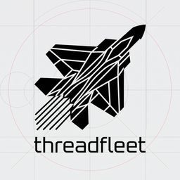

# ThreadFleet

[](https://github.com/wzxmer/ThreadFleet)

[中文](#threadfleet) | [English](#threadfleet-1)



ThreadFleet 是一个基于 Tauri 的开源 Codex Agent 桌面工作台，用来协调本地项目、会话、Git 变更、提示词和远程后端，支持 Windows、macOS 和 Linux。

关键词：ThreadFleet、Codex 桌面客户端、Codex 多会话管理、Codex Agent 工作区管理。

## 项目来源与许可

ThreadFleet 是基于 [Thomas Ricouard](https://github.com/Dimillian) 开发的 [CodexMonitor](https://github.com/Dimillian/CodexMonitor) 衍生而来的独立开源项目，继续采用 [MIT 许可证](LICENSE)。原项目版权声明与许可文本完整保留。

ThreadFleet 与 OpenAI 及原 CodexMonitor 项目不存在隶属、赞助或官方背书关系。`Codex` 仅用于说明兼容的工具和工作流。

## 下载

ThreadFleet 当前尚未发布安装包；需要体验时请先按下方说明从源码构建。未来正式安装包将放在 [Releases](https://github.com/wzxmer/ThreadFleet/releases) 页面：

- Windows: `.exe` / `.msi`
- macOS: `.dmg`
- Linux: `.AppImage` / `.rpm`

Windows 默认继续使用与当前安装相同的格式更新：`.exe` 对应 NSIS，`.msi` 对应 MSI。“设置 > 关于”提供默认关闭的实验性 NSIS→MSI 迁移选项；只有本机安装归属、目标 MSI 和隔离验证门全部通过后才会下载但不直接打开 MSI，并要求用户再次确认。当前发布版的迁移执行门保持关闭，因此启用该选项仍会使用原安装器类型。应用检测到两种格式共存或安装器归属不明时会停止自动更新，并提供“查看修复”。只有当前 MSI 健康且仅存在一个可验证的旧 NSIS 残留时才允许修复；无法验证旧 `.lnk` 快捷方式等状态会保持只读阻止。迁移和修复都不会运行旧卸载器；操作前仍建议备份重要数据。

macOS 版本当前采用完整 ad-hoc 签名，但尚未使用 Apple Developer ID 公证。首次启动若被 Gatekeeper 阻止，请在“应用程序”中右键 ThreadFleet 并选择“打开”，或前往“系统设置 > 隐私与安全性 > 仍要打开”；正常情况下无需执行 `xattr` 命令。

## 主要增强

- 中文界面：侧边栏、设置、消息、提示、按钮和常用状态文案中文化。
- 视觉统一：设置页、侧栏、消息区和弹层控件改为更一致的桌面软件风格。
- 对话显示：统一使用原生阅读样式；默认亮色，可切换暗色，暗色模式使用统一原生暗色外观。
- 字体体验：默认使用 `PingFang SC` / 内置 `Noto Sans SC Variable` / `Microsoft YaHei UI` 字体链，中文显示更圆润饱满；支持 UI、会话、过程状态、代码四类字号独立调整，UI 字号同步覆盖侧栏、设置、工具栏、弹层和输入区。
- 模型服务商管理：按“服务商 > 分组 > API 密钥”管理连接、模型能力和多组凭据；可选自动、原生 Responses 或 Chat Completions 兼容网关传输。每个已保存 API 密钥可独立验证结构化函数工具能力，验证不会执行本地工具。“保存”不会切换当前执行身份，“保存并启用”才会切换。复制服务商时保留连接与分组结构，但不复制 API 密钥或 Access Token。默认在切换服务商时保留同一套本机会话，可在“设置 > 模型服务商”独立控制会话保留和 `config.toml` 同步，并通过脱敏诊断确认当前会话来源。
- 模型无关工作流：ThreadFleet 统一匹配公共 skills、agents、项目规则和知识候选；默认使用不注入模型上下文的影子模式，可在“设置 > 工作流”切换关闭、影子或启用模式，并刷新 Registry、查看脱敏诊断。输入区支持为当前会话显式绑定 Workflow ID，绑定前会验证状态；已结束的工作流或仅支持手动检查的环境不会被标记为已绑定。
- 电脑操控路由：在“设置 > Codex > MCP”查看并刷新当前执行主机的能力状态。Windows 原生界面固定使用 `windows-ui`，依赖现有登录态的网页使用 Chrome，隔离网页使用 Browser；后端不可用时会明确停止，不静默切换会话边界或尝试 Computer Use。远程模式下操控发生在 daemon 主机，不是前端设备。
- 开发知识库适配：在“设置 > 工作流”查看本机 DevKnowledgeBase 的生成视图、ledger/runtime 健康与 stale 状态，运行带引用和 omitted 清单的检索；已声明但不再匹配当前源码历史的知识会自动排除并列入 omitted 清单。支持通过折叠式写入区捕获 Intake、初始化任务；所有写入经 `kb-core` 唯一入口执行，知识库或 Python CLI 不可用时客户端保持可用并明确显示降级，不在 ThreadFleet 内复制状态账本或保存 Provider 凭据。
- 用量显示：左下角 Codex 用量可开关，支持已用/剩余额度切换，并可独立按“服务商 > 分组 > API 密钥”选择用量凭据，不改变会话执行身份；第三方模型服务商可读取 Sub2 或 New API 用量，New API 可额外配置 Access Token 读取账户余额。日志不足以完整覆盖当天时会明确回退为累计消费；首页按小时、今日、近 7 天和本月汇总本机全部 Codex 会话，包含归档记录，并区分缓存读取和未缓存输入。
- 本机会话管理：以本机/归档分区展示完整元数据索引和每条会话的本地最后使用时间，可按最后使用、创建或归档日期，以及项目、来源、主会话/子 Agent、文件映射状态组合筛选并排序；未选择会话时显示当前结果的活动、项目和来源概览。进入时不读取正文，明确点击后默认定位到会话结尾，保留全部用户消息并仅展示 AI 最终答复，向上滚动可持续加载更早内容；跨项目可返回原项目或引用上下文到当前项目创建新会话，原项目已不存在时会使用独立且稳定的 `项目不存在-ABC` 临时工作区恢复。永久删除仅对已归档会话开放，并在确认后再次校验来源、归档状态、时间和精确文件映射。
- 消息体验：编辑失败消息后重发会覆盖原消息，避免重复堆积；“自动重连”默认关闭，手动开启后仅对当前会话有效，在任务非主动中止时持续尝试恢复连接并继续，且不占用 Codex 当前任务的尝试次数；图片粘贴、拖放和预览支持悬浮复制、应用内大图查看，内部生成图片使用紧凑显示名；达到 4,000 字符或 80 行的大量文本粘贴会自动转为可预览、可恢复的 TXT 附件。
- 会话正文导出：可选择部分或全部用户/AI 消息导出为 A4 纵向 PDF 或单张 PNG；工具调用与过程状态会被过滤，消息图片保留，生成和分块保存进度可见并可取消。
- 执行结果摘要：任务结束后保留匹配执行的文件新增/删除行数和 Working 用时；切换会话或重启应用后仍可恢复本机已记录摘要，旧会话缺少记录时不会补造统计。
- Git 工作流：查看改动、Diff、日志、分支、提交、推送/拉取，并支持 GitHub Issues/PR 列表与 PR 上下文提问。
- 远程后端：支持桌面 daemon、TCP/Tailscale 连接和 iOS 远程模式。
- 多会话任务协调：创建协调组绑定相关会话，声明文件/目录/逻辑资源 Ownership，阻止同一目录双写和已确认资源双写；候选检测用确定性关键词匹配并 shadow 记录已探测对，断线时保守保留写租约，不自动释放；计划面板空闲时显示协调面板。
- Shadow Router：只给出 `direct`、`delegate`、`review`、`decision-gate` 建议和原因码，不会自动派发、切换模型或修改 reasoning effort。建议仅使用当前 Provider 内已验证的模型能力，并复用任务协调的 owner、claim、lease 和冲突门；slot、depth、Token、timeout、retry、fallback 达到硬上限，模型未知或 effort 不受支持时转入 `decision-gate`。

## 功能概览

### 项目、会话与 Agent

- 添加、分组、排序和连接多个工作区。
- 可同时启动多个独立的 ThreadFleet 实例；后续启动不再只唤回已有窗口。
- 启动或恢复 Codex `app-server` 会话，显示运行中、未读、审批和用户输入状态。
- 长会话按设置数量分批显示；滚动到顶部或底部可继续加载，当前会话搜索会自动展开并定位隐藏历史，避免一次性渲染全部内容。
- 消息支持引用选中内容或整条消息到当前/新会话；引用先进入目标会话输入框草稿，由用户确认后发送；Composer 可折叠长引用、展开预览、单条移除和调整多条引用顺序；长内容可用智能引用保存为后端只读快照，按需读取，避免把全文重复塞入上下文。
- 大型文本附件、日志和 diff 会优先保存为内容寻址快照并发送轻量引用；小文件或旧版远程端继续按原方式内联。
- 新建普通 Agent、worktree Agent 和副本 Agent，隔离实验性改动。
- 子会话根据父会话主要语言生成任务标题，生成不可用时回退下发任务名；并可按“仅最终结果 / 关键检查点 / 持续同步”向父会话反馈进展，父会话运行中使用 steer 实时注入，空闲时等待下一轮，不会自动启动新 turn，已同步内容在会话中显示为轻量系统条目。
- 父会话会将子会话结果整理为精简摘要；长结果可在右侧详情面板独立阅读、复制或打开对应子会话，避免完整输出淹没总控结论。
- Pin、重命名、归档、复制、停止和中断会话。
- 本地 Codex 历史会话按项目和来源聚合，缺失项目和子代理会话可单独识别。
- ThreadFleet 与其他 Codex 客户端使用同一 `CODEX_HOME` 时默认共用会话库，无需同步开关或复制数据；在“设置 > Codex”可确认默认、独立或远程状态。两端刷新后可看到已持久化更新，不建议同时操作同一个会话。

### 输入框与模型控制

- 图片附件支持选择、拖放和粘贴。
- 支持 `$` 技能、`/prompts:` 提示词、`/review`、`@` 文件路径补全。
- 可配置默认跟进行为：排队发送或在运行中 steer。
- 模型、推理强度、访问模式、协作模式和上下文用量在输入区集中控制。
- 输入框边框按当前周期 Token 与模型上下文窗口显示真实占用；压缩开始时显示运行状态，完成后更新并保留该会话的累计压缩次数。
- 重新编辑失败消息时沿用输入框当前发送快捷键规则；编辑面板使用紧凑操作区，不额外显示快捷键提示。
- `设置 > Codex > 默认参数` 提供质量、均衡、节省三档 Token 效率策略，并可设置单次工具输出写入会话历史的 Token 预算；策略仅影响新会话，输出预算在重连工作区后生效。
- 支持语音输入和按住说话快捷键。

### Git、GitHub 与文件

- 文件树搜索、图标、快速打开和 Reveal in Finder/Explorer。
- Git 状态、分文件 Diff、暂存/撤销、提交日志、分支切换和同步。
- GitHub Issues/PR 读取、PR Diff/评论查看，以及将 PR 上下文发送给 Agent。
- 全局和工作区提示词库支持创建、编辑、删除、移动和直接运行。

### 设置与体验

- 设置分区覆盖显示、输入、会话、项目、Codex、工作流、Git、功能、快捷键、更新和环境。
- 会话设置可按 30/60/90/180 天管理归档会话永久清理；功能默认关闭，开启和立即清理都需明确二次确认，自动检查最多每 24 小时一次，并保护当前、运行中和置顶会话。
- UI 缩放、字体、字号、字重、透明效果、消息文件路径、工具折叠、Diff 预加载等可配置。
- 侧栏、右侧面板、计划面板、终端和调试面板尺寸持久化。
- 通知声音、长任务完成系统通知（窗口聚焦或后台均显示）、更新提示、调试日志复制和清空。
- 应用更新默认使用 GitHub；发布者配置腾讯 COS / 阿里 OSS 后，检查或下载失败会按 COS、OSS 顺序自动切换，并校验安装包大小与 SHA-256。
- 桌面/平板/手机响应式布局，iOS 走远程后端模式。

## 环境要求

- Node.js + npm
- Rust stable toolchain
- CMake
- Windows 构建需要 LLVM/Clang（`bindgen` / `libclang`）
- Codex CLI 可在 `PATH` 中作为 `codex` 运行，或在设置中指定自定义路径
- Git CLI
- GitHub CLI `gh`（可选，用于 Issues/PR 功能）

遇到原生依赖或环境问题时运行：

```bash
npm run doctor
```

## 本地开发

安装依赖：

```bash
npm install
```

启动桌面开发模式：

```bash
npm run tauri:dev
```

常用验证：

```bash
npm run typecheck
npm run test
npm run lint
cd src-tauri && cargo check
```

生产构建：

```bash
npm run tauri:build
```

Windows 专用构建：

```bash
npm run tauri:build:win
```

产物位于 `src-tauri/target/release/bundle/`。

Release 工作流统一使用 `src-tauri/tauri.conf.json` 中的合法 SemVer 作为包内版本、GitHub Tag、Release 标题、下载链接和公开资产版本。`v0.8.01` 与 `v0.8.02` 为历史版本；后续版本从 `v0.8.13` 继续递增。

### 国内更新镜像（可选）

镜像全部未配置时保持 GitHub-only，不影响构建。启用镜像时，在 GitHub `release` Environment 配置：

- Variables：`TENCENT_UPDATE_BASE_URL`、`TENCENT_UPDATE_MANIFEST_URL`、`TENCENT_COS_BUCKET`、`TENCENT_COS_REGION`
- Secrets：`TENCENT_COS_SECRET_ID`、`TENCENT_COS_SECRET_KEY`
- Variables：`ALIYUN_UPDATE_BASE_URL`、`ALIYUN_UPDATE_MANIFEST_URL`、`ALIYUN_OSS_BUCKET`、`ALIYUN_OSS_ENDPOINT`
- Secrets：`ALIYUN_OSS_ACCESS_KEY_ID`、`ALIYUN_OSS_ACCESS_KEY_SECRET`
- Variables：`TENCENT_CODEX_CLI_BASE_URL`、`TENCENT_CODEX_CLI_MANIFEST_URL`
- Variables：`ALIYUN_CODEX_CLI_BASE_URL`、`ALIYUN_CODEX_CLI_MANIFEST_URL`

`*_UPDATE_BASE_URL` 是公开下载根地址，`*_UPDATE_MANIFEST_URL` 通常为该根地址下的 `latest.json`。发布流程会生成版本目录、校验值和清单，并仅在对应配置完整时上传。Release 在构建前审计两家镜像配置并写入 Actions Summary；半配置、非 HTTPS 公共地址、只有下载线路但缺少上传凭据，都会直接阻止发布，避免生成无法回退的安装包。

发布流程还会从 OpenAI 官方 Codex Release 获取各平台完整 CLI package（包含相关辅助组件），重新打包为统一 ZIP，生成 `codex-cli-latest.json` 并同步到 GitHub、COS 和 OSS。客户端未检测到可运行的 `codex app-server` 时，会提示用户确认后自动下载到应用数据目录，不修改系统 PATH。

## 远程后端与 iOS

iOS 当前以远程后端为主：手机端连接桌面或服务器上的 ThreadFleet daemon。桌面端默认仍是本地优先。

### Tailscale TCP 连接

1. 桌面和 iPhone 登录同一个 Tailscale tailnet。
2. 桌面 ThreadFleet 打开 `设置 > 服务器`。
3. 设置 Remote backend token。
4. 启动 Mobile access daemon。
5. 使用 Tailscale helper 检测主机地址，例如 `your-mac.your-tailnet.ts.net:4732`。
6. iOS 端填写同一个主机地址和 token。
7. 点击连接测试。

桌面 daemon 必须保持运行；连接失败时先检查 Tailscale 在线状态、地址和 token。

### 无桌面 UI 的 daemon 管理

```bash
cd src-tauri
cargo build --bin codex_monitor_daemon --bin codex_monitor_daemonctl
./target/debug/codex_monitor_daemonctl status
./target/debug/codex_monitor_daemonctl start
./target/debug/codex_monitor_daemonctl stop
```

常用参数：

- `--data-dir <path>`: 指定包含 `settings.json` / `workspaces.json` 的数据目录
- `--listen <addr>`: 覆盖监听地址
- `--token <token>`: 覆盖 token
- `--daemon-path <path>`: 指定 daemon 二进制路径
- `--json`: 输出机器可读 JSON

### iOS 构建

安装目标：

```bash
rustup target add aarch64-apple-ios aarch64-apple-ios-sim
```

模拟器：

```bash
./scripts/build_run_ios.sh
```

真机：

```bash
./scripts/build_run_ios_device.sh --list-devices
./scripts/build_run_ios_device.sh --device "<device name or identifier>" --team <TEAM_ID>
```

TestFlight 发布脚本：

```bash
./scripts/release_testflight_ios.sh
```

本地签名配置优先放在 `src-tauri/tauri.ios.local.conf.json`。

## 项目结构

```text
src/
  features/                         前端功能模块
  features/app/bootstrap/           启动和恢复编排
  features/app/orchestration/       布局、线程、工作区编排
  features/threads/hooks/           会话状态和消息 reducer
  services/                         Tauri IPC 封装
  styles/                           按区域拆分的 CSS
  types.ts                          前端共享类型
src-tauri/
  src/lib.rs                        Tauri 命令注册
  src/bin/codex_monitor_daemon.rs   远程 daemon 入口
  src/bin/codex_monitor_daemon/rpc/ daemon RPC 处理
  src/shared/                       App 与 daemon 共用核心逻辑
  src/codex/                        Codex app-server 适配
  src/workspaces/                   工作区和 worktree 适配
```

更详细的任务导向文件地图见 `docs/codebase-map.md`。

## 数据与配置

- 工作区保存到应用数据目录的 `workspaces.json`。
- 设置保存到应用数据目录的 `settings.json`。
- Codex 配置读取 `$CODEX_HOME/config.toml` 或 `~/.codex/config.toml`；Provider 配置支持 OpenAI、DeepSeek、OpenRouter、OpenCode Zen 和自定义 OpenAI 兼容服务。“切换服务商时保留本机会话”默认开启，“同步到本机 `config.toml`”默认关闭；仅在同步开启时写入 Provider、模型和上下文参数，不写入密钥或会话数据。切回默认 Provider 或关闭同步时会恢复启用同步前的 Provider 与模型字段，并保留无关配置修改。OpenCode Zen 与 Base URL 为 `api.duckcoding.ai` 的配置会自动使用兼容网关转换 Codex Responses API 请求，也可在服务商中明确选择原生 Responses 或兼容网关；OpenCode Zen 仍要求选择明确模型。
- 自定义提示词读取 `$CODEX_HOME/prompts` 或 `~/.codex/prompts`。
- worktree Agent 默认位于应用数据目录 `worktrees/<workspace-id>`，旧 `.codex-worktrees/` 路径仍兼容。
- UI 状态如面板尺寸、透明度和最近活动保存在 `localStorage`。

## 维护入口

- 前端 IPC：`src/services/tauri.ts`
- Tauri 命令：`src-tauri/src/lib.rs`
- Daemon RPC：`src-tauri/src/bin/codex_monitor_daemon/rpc.rs`
- 共享后端核心：`src-tauri/src/shared/`
- 代码导航：`docs/codebase-map.md`


---

# ThreadFleet

[](https://github.com/wzxmer/ThreadFleet)

[中文](#threadfleet) | [English](#threadfleet-1)

ThreadFleet is an open-source Tauri desktop workspace for coordinating Codex agents, local projects, sessions, Git changes, prompts, and remote backends. It supports Windows, macOS, and Linux.

## Origin and license

ThreadFleet is an independent open-source project derived from [CodexMonitor](https://github.com/Dimillian/CodexMonitor) by [Thomas Ricouard](https://github.com/Dimillian). It remains available under the [MIT License](LICENSE), with the original copyright notice and license text preserved.

ThreadFleet is not affiliated with, sponsored by, or endorsed by OpenAI or the original CodexMonitor project. `Codex` is used only to describe compatible tools and workflows.

## Download

ThreadFleet does not have published installers yet; build it from source using the instructions below. Future official installers will be available on the [Releases](https://github.com/wzxmer/ThreadFleet/releases) page:

- Windows: `.exe` / `.msi`
- macOS: `.dmg`
- Linux: `.AppImage` / `.rpm`

Windows updates use the current installer family by default: `.exe` for NSIS and `.msi` for MSI. Settings > About exposes an experimental NSIS-to-MSI option that is off by default. It downloads an MSI without opening it and asks for confirmation only after local ownership, artifact validation, and the isolated-validation runtime gate all pass. That runtime gate remains closed in current releases, so enabling the option still keeps same-family updates. Automatic updates stop when both families are registered or ownership is unclear, with **View repair** available for the narrowly supported stale-NSIS case. Migration and repair never run the old uninstaller; backing up important data first remains recommended.

The macOS build is fully ad-hoc signed but not notarized with Apple Developer ID. If Gatekeeper blocks first launch, right-click ThreadFleet in Applications and select "Open", or go to "System Settings > Privacy & Security > Open Anyway". Running `xattr` is normally unnecessary.

## Chinese-First Enhancements

- **Localized UI**: sidebar, settings, messages, prompts, buttons, and common status text in Chinese.
- **Visual consistency**: settings, sidebar, message area, and overlay controls share a unified desktop software style.
- **Conversation display**: uses one native reading style globally. Light mode is the default, with a manual dark-mode toggle that uses the shared native dark appearance.
- **Typography**: defaults to `PingFang SC` / bundled `Noto Sans SC Variable` / `Microsoft YaHei UI` font chain for fuller Chinese rendering. Four independent font sizes for UI, chat, process status, and code.
- **Provider management**: manage connections, model capabilities, and multiple credentials as Provider > Group > API key. Choose automatic, native Responses, or the Chat Completions compatibility gateway transport. Each saved API key can independently verify structured function-tool capability without executing local tools. Save keeps the current execution identity; Save and enable switches it. Duplicating a Provider preserves connection settings and group structure without copying API keys or access tokens. Provider switches keep the same local session library by default; Settings > Model Providers also exposes independent session-preservation and `config.toml` sync controls plus redacted session-source diagnostics. OpenCode Zen and configurations whose Base URL is `api.duckcoding.ai` automatically use the compatibility gateway for Codex Responses API requests.
- **Model-agnostic workflow**: ThreadFleet matches public skills, agents, project rules, and knowledge candidates. Shadow mode (no model context injection) is the default; toggle via Settings > Workflow.
- **Computer-control routing**: Settings > Codex > MCP shows refreshable capability status for the current execution host. Native Windows UI uses `windows-ui`, signed-in web tasks use Chrome, and isolated web tasks use Browser. An unavailable backend stops explicitly instead of crossing session boundaries or trying Computer Use. In remote mode, control occurs on the daemon host, not the frontend device.
- **Development knowledge adapter**: Settings > Workflow shows DevKnowledgeBase view and database health, supports citation-backed retrieval, moves declared evidence that no longer belongs to the current source history into the omitted list, and exposes guarded Intake capture and task initialization through the single `kb-core` writer. Missing local knowledge tooling degrades explicitly without blocking the client.
- **Usage display**: toggle Codex usage in the bottom-left, switch between used/remaining quota, and independently choose a Provider, Group, and API key without changing the execution identity. Third-party Providers can read Sub2 or New API usage; New API credentials may add an access token for account balance. When available logs cannot fully cover the current day, the UI explicitly falls back to cumulative spending. The home page summarizes all locally available Codex sessions by hour, day, week, and calendar month, including archived records, and distinguishes cached reads from uncached input.
- **Local session management**: total local session count, local last-used timestamps for every session, and a unified history entry. Session content is not read on entry; explicitly selecting one session opens at its latest messages, preserves every user message, shows only final AI answers, and continuously loads older content while scrolling upward. Cross-project return and context references can create new sessions; when the original project no longer exists, continuation uses a stable isolated `项目不存在-ABC` temporary workspace. List context menus also support deriving to the current project, archiving, permanently deleting sessions, and copying session IDs. Active sessions are safely archived before permanent deletion; spawned subagent sessions generate task titles in the parent conversation's primary language and fall back to assigned task names when generation is unavailable.
- **Codex session sharing**: ThreadFleet and other Codex clients automatically share one session library when they resolve the same `CODEX_HOME`; no sync toggle or file copying is involved. Settings > Codex reports default, separate, or remote status. Refresh either client to see persisted updates, and avoid operating the same thread in both clients at once.
- **Multiple app instances**: launch additional independent ThreadFleet instances instead of redirecting later launches to an existing window.
- **Subagent result summaries**: parent conversations show compact child-result summaries, while long outputs open in a dedicated detail panel for reading, copying, or opening the child thread without burying the parent conclusion.
- **Message experience**: references to the current or a new conversation enter the target composer as a draft and require explicit send; long references can be collapsed or previewed, individual references removed, and multiple references reordered; failed message re-send overwrites the original, auto-reconnect per session, large paste auto-converts to a previewable and restorable TXT attachment at 4,000 chars or 80 lines, image paste/drag/drop with hover copy and in-app large view.
- **Message editing**: re-editing a failed message follows the composer’s current send-shortcut rule and uses a compact action surface without extra shortcut hints.
- **Conversation export**: export selected or all user/AI messages as a portrait A4 PDF or one PNG image. Tool calls and process states are filtered out, message images are preserved, and generation plus chunked-save progress is visible and cancellable.
- **Execution summaries**: completed runs retain their matching added/deleted line counts and Working duration across thread switches and app restarts; older sessions without local summary data are left unchanged.
- **Git workflow**: view changes, diffs, logs, branches, commit, push/pull, plus GitHub Issues/PR lists and PR context questions.
- **Remote backend**: desktop daemon, TCP/Tailscale connection, and iOS remote mode.
- **Task coordination**: create coordination groups, declare resource ownership, block double-write conflicts; deterministic candidate detection with shadow recording; coordination panel in plan area when idle; leases kept on disconnect.
- **Shadow Router**: returns only `direct`, `delegate`, `review`, or `decision-gate` advice with reason codes. It never dispatches work or changes model/effort, stays within the active Provider's verified capabilities, reuses coordination ownership/claim/lease/conflict gates, and fails closed when bounded execution limits or capability checks are exhausted.

## More Details

For build instructions, project structure, data configuration, and remote backend setup, see the [Chinese section](#threadfleet) above — the technical details apply regardless of language.
